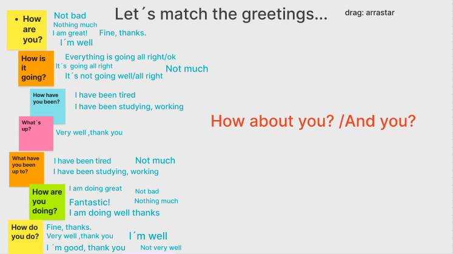

# work-and-travel-english-class

English course for prepare go to work and travel

<link rel="stylesheet" href="https://cdnjs.cloudflare.com/ajax/libs/font-awesome/6.5.2/css/all.min.css">

## Class one - Today is thursday, 16th, 2025

<a href="https://www.youtube.com/watch?v=7c7Wrp4-6eg">Class video</a>

<h5>[Study plan - Week 03]</h5>
<table>
    <tr>
        <td>monday(listening)</td>
        <td><a href="https://www.youtube.com/watch?v=fNRbpSKf0-Q">The alphabet</a></td>
        <td><i class="fa-solid fa-check" style="color:green;"></i></td>
    </tr>
    <tr>
        <td>tuesday(reading/speaking)</td>
        <td><a href="https://www.youtube.com/watch?v=h2LhsO7aVmM">Greetings</a></td>
        <td><i class="fa-solid fa-check" style="color:green;"></i></td>
    </tr>
    <tr>
        <td>wednesday</td>
        <td>
Spell the words: computer /  chair / tape / colors / hair / paper / cookies
</td>
        <td><i class="fa-solid fa-check" style="color:green;"></i></td>
    </tr>
    <tr>
        <td>thursday(listening)</td>
        <td>
<strong>our class</strong>
</td>
        <td><i class="fa-solid fa-check" style="color:green;"></i></td>
    </tr>
    <tr>
        <td>friday(speaking)</td>
        <td>
pract the greetings of video.
</td>
        <td><i class="fa-solid fa-check" style="color:green;"></i></td>
    </tr>
    <tr>
        <td>saturday</td>
        <td>
Free: listen a music, watch a movie
</td>
        <td><i class="fa-solid fa-check" style="color:green;"></i></td>
    </tr>
    <tr>
        <td>sunday</td>
        <td>
Free: listen a music, watch a movie
</td>
        <td><i class="fa-solid fa-check" style="color:green;"></i></td>
    </tr>
</table>

<h5>[Presentations]</h5>

    i'm Dionatan and i have twenty three years. i am from the border between Brasil and Uruguay, but actually i live of camobi neighborhod in Santa Maria. i study science computation at UFSM  and be sixth semester of graduation. I like programming, going to gym and i love going to girlfriend's house.

    i'm Paola and i have twenty three years. I study dentistry in ufsm. I like read, dance and walk. My favorite moment is when i go to partys. I hate winter, but i want to know snow. My biggest dream is travel.I love chocolate, dogs and my boyfriend. 

<h5>[Translations]</h5>

neighbor - vizinho  
<a href="https://dictionary.cambridge.org/">dicionary cambridge</a>

<h5>[Classroom Language]</h5>
<ol>
    <li>How do you say ... in english ?</li>
    <li>Teacher, can you repat, please?</li>
    <li>can you spell it, please?</li>
    <li>how do you write this word</li>
    <li>i have a question... my question is ...</li>
    <li>i am finished, i'm finished</li>
    <li>i'm sorry i don't understand</li>
</ol>

<h5>[Spell it names]</h5>

paola kope schmitt da rosa 
dionatan eduardo correa rodrigues 

<h5>[Greetings]</h5>

Greetings exercise 

## Class two - Today is thursday january, 23th, 2025

<a href="https://www.youtube.com/watch?v=qISsAtPmPB4">Class video</a>

<h5>[Study plan - Week 04]</h5>
<table>
    <tr>
        <td>monday(listening)</td>
        <td><a href="https://www.youtube.com/watch?v=qC0l6GQZtM4">th sound</a></td>
        <td><i class="fa-solid fa-check" style="color:green;"></i></td>
    </tr>
    <tr>
        <td>tuesday(reading/listening)</td>
        <td><a href="https://www.liveworksheets.com/w/en/english-second-language-esl/256436">practice days of the week</a></td>
        <td><i class="fa-solid fa-x" style="color:red;"></i></td>
    </tr>
    <tr>
        <td>wednesday</td>
        <td><a href="https://www.youtube.com/watch?v=xlCBWlsKZXY">see the idea of the routine video</a></td>
        <td><i class="fa-solid fa-x" style="color:red;"></i></td>
    </tr>
    <tr>
        <td>thursday(listening)</td>
        <td>
<strong>our class</strong>
</td>
        <td><i class="fa-solid fa-x" style="color:red;"></i></td>
    </tr>
    <tr>
        <td>friday(speaking)</td>
        <td>
Record your own vlog!!! Describe the activities you do every day
</td>
        <td><i class="fa-solid fa-x" style="color:red;"></i></td>
    </tr>
    <tr>
        <td>saturday</td>
        <td>
Free: listen a music, watch a movie
</td>
        <td><i class="fa-solid fa-x" style="color:red;"></i></td>
    </tr>
    <tr>
        <td>sunday</td>
        <td>
Free: listen a music, watch a movie
</td>
        <td><i class="fa-solid fa-x" style="color:red;"></i></td>
    </tr>
</table>
