# work-and-travel-english-class

English course for prepare go to work and travel

<link rel="stylesheet" href="https://cdnjs.cloudflare.com/ajax/libs/font-awesome/6.5.2/css/all.min.css">

## Class one - Today is thursday, 16th, 2025

    <a href="https://www.youtube.com/watch?v=7c7Wrp4-6eg">Class video</a>
    <h5>[Presentations]</h5>
    

        i'm Dionatan and i have twenty three years. i am from the border between Brasil and Uruguay, but actually i live of camobi neighborhod in Santa Maria. i study science computation at UFSM  and be sixth semester of graduation. I like programming, going to gym and i love going to girlfriend's house.
    

    

        i'm Paola and i have twenty three years. I study dentistry in ufsm. I like read, dance and walk. My favorite moment is when i go to partys. I hate winter, but i want to know snow. My biggest dream is travel.I love chocolate, dogs and my boyfriend.
    

    <h5>[Translations]</h5>
    
neighbor - vizinho  
    <a href="https://dictionary.cambridge.org/">dicionary cambridge</a>
    

    <h5>[Classroom Language]</h5>
    <ol>
        <li>How do you say ... in english ?</li>
        <li>Teacher, can you repat, please?</li>
        <li>can you spell it, please?</li>
        <li>how do you write this word</li>
        <li>i have a question... my question is ...</li>
        <li>i am finished, i'm finished</li>
        <li>i'm sorry i don't understand</li>
    </ol>
    <h5>[Spell it names]</h5>
    
paola kope schmitt da rosa 
    dionatan eduardo correa rodrigues 

    <h5>[Greetings]</h5>
    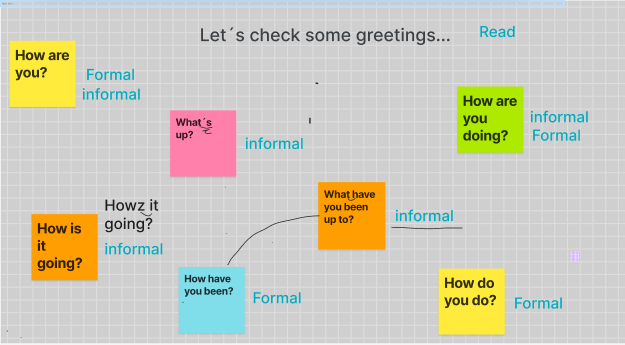
    
Greetings exercise 

    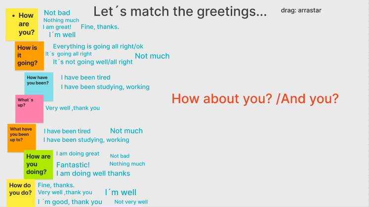

## Class two - Today is thursday january, 23rd, 2025

    <a href="https://www.youtube.com/watch?v=qISsAtPmPB4">Class video</a>
    
Topic: days of the week - periods of the day - daily routine

    <h5>[Study plan]</h5>
    <table>
        <tr>
            <td>monday(listening)</td>
            <td><a href="https://www.youtube.com/watch?v=fNRbpSKf0-Q">The alphabet</a></td>
            <td><i class="fa-solid fa-check" style="color:green;"></i></td>
        </tr>
        <tr>
            <td>tuesday(reading/speaking)</td>
            <td><a href="https://www.youtube.com/watch?v=h2LhsO7aVmM">Greetings</a></td>
            <td><i class="fa-solid fa-check" style="color:green;"></i></td>
        </tr>
        <tr>
            <td>wednesday</td>
            <td>
Spell the words: computer /  chair / tape / colors / hair / paper / cookies
</td>
            <td><i class="fa-solid fa-check" style="color:green;"></i></td>
        </tr>
        <tr>
            <td>thursday(listening)</td>
            <td>
<strong>our class</strong>
</td>
            <td><i class="fa-solid fa-check" style="color:green;"></i></td>
        </tr>
        <tr>
            <td>friday(speaking)</td>
            <td>
pract the greetings of video.
</td>
            <td><i class="fa-solid fa-check" style="color:green;"></i></td>
        </tr>
        <tr>
            <td>saturday</td>
            <td>
Free: listen a music, watch a movie
</td>
            <td><i class="fa-solid fa-check" style="color:green;"></i></td>
        </tr>
        <tr>
            <td>sunday</td>
            <td>
Free: listen a music, watch a movie
</td>
            <td><i class="fa-solid fa-check" style="color:green;"></i></td>
        </tr>
    </table>
    <h5>[Class content]</h5>
    

        Day of the week: thursday  
        month: january  
        day: 23rd  
        year: 2025  
    

    

        Weekend is saturday and sunday!
    

    

        What did you do on the weekend ? 
        i go(went) to the (mall/store)  
        i worked and studied on the weekend 
        i wroked and went to Paola's house
    

    <h5>[Translations]</h5>
    
pizza place - pizzaria

    <h5>[Days of the week]</h5>
    
sunday - monday - tuesday - wednesday - thursday - friday - saturday

    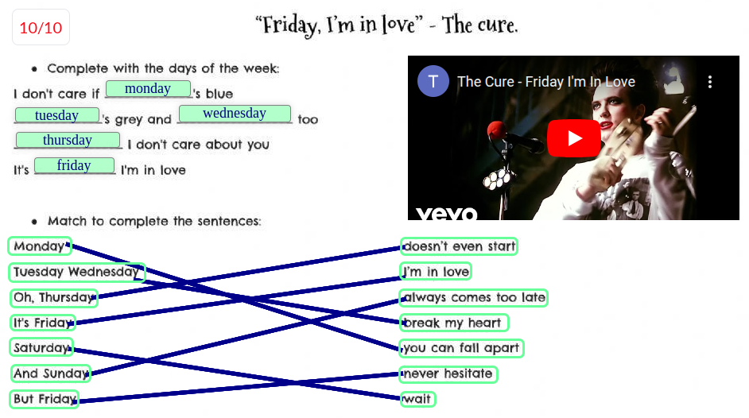
    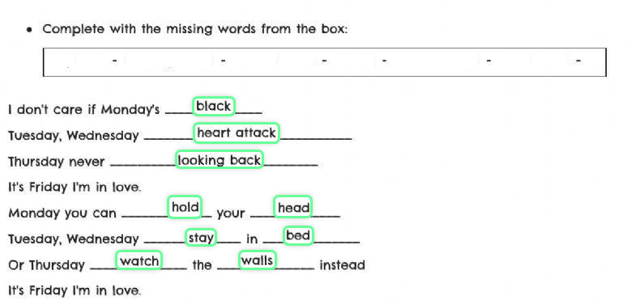
    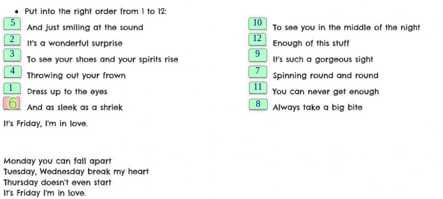
    <h5>[Routine]</h5>
    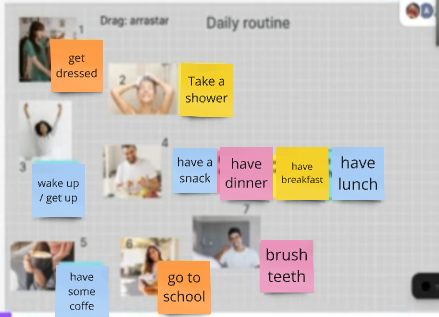
    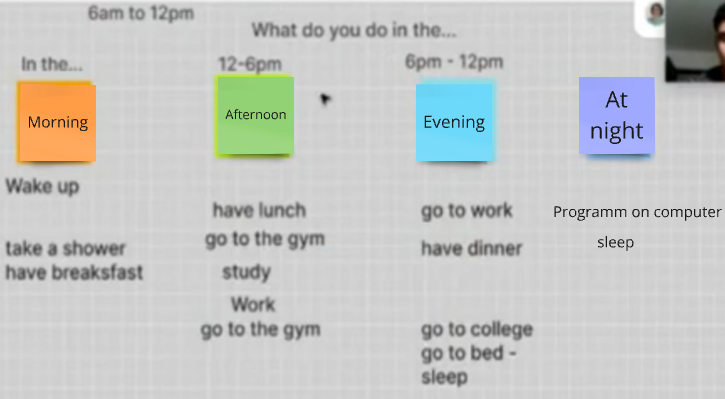
    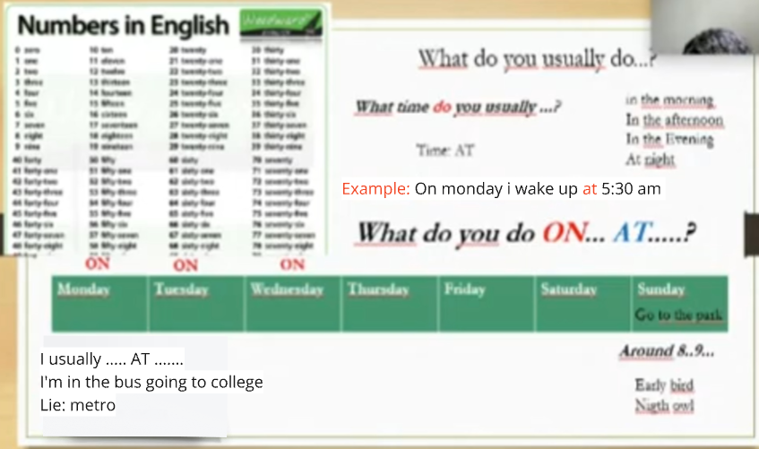

## Class three - Today is thursday january, 30th, 2025

    <a href="https://www.youtube.com/watch?v=jFiWkDE4BmE">Class video</a>
    <h5>[Study plan]</h5>
    <table>
        <tr>
            <td>monday(listening)</td>
            <td><a href="https://www.youtube.com/watch?v=qC0l6GQZtM4">th sound</a></td>
            <td><i class="fa-solid fa-check" style="color:green;"></i></td>
        </tr>
        <tr>
            <td>tuesday(reading/listening)</td>
            <td><a href="https://www.liveworksheets.com/w/en/english-second-language-esl/256436">practice days of the week</a></td>
            <td><i class="fa-solid fa-check" style="color:green;"></i></td>
        </tr>
        <tr>
            <td>wednesday</td>
            <td><a href="https://www.youtube.com/watch?v=xlCBWlsKZXY">see the idea of the routine video</a></td>
            <td><i class="fa-solid fa-check" style="color:green;"></i></td>
        </tr>
        <tr>
            <td>thursday(listening)</td>
            <td>
<strong>our class</strong>
</td>
            <td><i class="fa-solid fa-check" style="color:green;"></i></td>
        </tr>
        <tr>
            <td>friday(speaking)</td>
            <td>
Record your own vlog!!! Describe the activities you do every day
</td>
            <td><i class="fa-solid fa-check" style="color:green;"></i></td>
        </tr>
        <tr>
            <td>saturday</td>
            <td>
Free: listen a music, watch a movie
</td>
            <td><i class="fa-solid fa-check" style="color:green;"></i></td>
        </tr>
        <tr>
            <td>sunday</td>
            <td>
Free: listen a music, watch a movie
</td>
            <td><i class="fa-solid fa-check" style="color:green;"></i></td>
        </tr>
    </table>
    <h5>[Class content]</h5>
    

        How was the weekend ? 
        I worked 
        I made candies 
        I didn't go to the gym  
        I stayed home
    

    

        I went to girlfrien<strong style="color:red;">d's h</strong>ouse 
        I was my mo<strong style="color:red;">m's b</strong>irthday 
        Stayed at Dionata<strong style="color:red;">n's h</strong>ouse 
        I'm on vacation 
        i went to beach with family of my girlfriend 
    

    <h5>[Continent and Nationality]</h5>
    

        Africa / african 
        Ásia / asian 
        Australia / australian 
        Europe / European 
        North America / North American 
        South America / South American 
    

    <h5>[Translations]</h5>
    

        bakery : padaria 
        Shame on you ! : você deveria se envergonhar ! 
        He's never been able to dance : Ele nunca foi capaz de dançar 
        She hates not being able to drive : Ela odeia não poder dirigir 
        flag - bandeira
    

    <h5>[Numbers]</h5>
    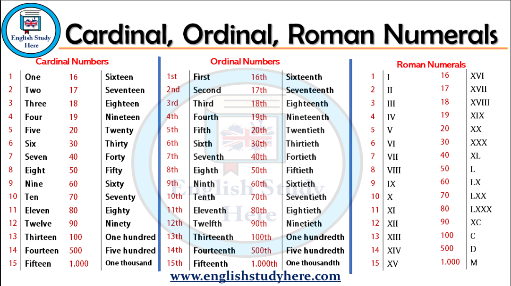

## Class four - Today is thursday february, 06th, 2025

    <a href="https://www.youtube.com/watch?v=dN4WUonZiWI">Class video</a>
    <h5>[Study plan]</h5>
    <table>
        <tr>
            <td>monday(listening)</td>
            <td><a href="https://www.youtube.com/watch?v=Ok_HG-0lNCA&t=183s"> Sound / I /</a></td>
            <td><i class="fa-solid fa-check" style="color:green;"></i></td>
        </tr>
        <tr>
            <td>tuesday(reading/listening)</td>
            <td><a href="https://www.guinnessworldrecords.com.br/world-records/729724-first-global-pop-group">Most nationalities</a></td>
            <td><i class="fa-solid fa-check" style="color:green;"></i></td>
        </tr>
        <tr>
            <td>wednesday</td>
            <td><a href="https://wordwall.net/pt/resource/54382911/nationalities-famous-people">Nationalities (famous people)
            </a></td>
            <td><i class="fa-solid fa-check" style="color:green;"></i></td>
        </tr>
        <tr>
            <td>thursday(listening)</td>
            <td>
<strong>our class</strong>
</td>
            <td><i class="fa-solid fa-check" style="color:green;"></i></td>
        </tr>
        <tr>
            <td>friday(speaking)</td>
            <td>
Record your own vlog!!! Describe the activities you do every day
</td>
            <td><i class="fa-solid fa-check" style="color:green;"></i></td>
        </tr>
        <tr>
            <td>saturday</td>
            <td>
Free: listen a music, watch a movie
</td>
            <td><i class="fa-solid fa-check" style="color:green;"></i></td>
        </tr>
        <tr>
            <td>sunday</td>
            <td>
Free: listen a music, watch a movie
</td>
            <td><i class="fa-solid fa-check" style="color:green;"></i></td>
        </tr>
    </table>
    <h5>[Class content]</h5>
    

        I have 19 
        Last year Julia was 17  
        Julia is 18 - She will be 19 years old   
        I will turn 19   
        How old are you? - Dionatan is 23   
        When is your birthday? march 19th 
        19th of march I will be 24 
        I'll be 24   
        September 14th - I'll be 20 years old  
        choose one country 
        is Germany inm Ásia? Yes, it's || No, it isn't 
        Where is Germany ? It is in Europe  
        Is George Clooney is spanish ? No, he isn't 
        Where is he from ? He is American   
        Is Guinnes grom Portugal ? No, it isn't 
        Where is it from ? It is from Ireland, It is Irish  
        Are pizza and pasta from Portugal ? No, they aren't 
        They're from Itally
    

    <h5>[Full form - contraction]</h5>
    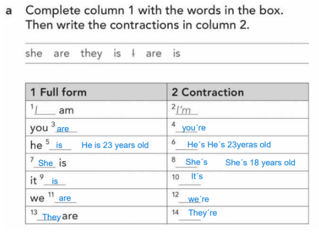
    <h5>[Traslations]</h5>
    

        come: vir  
        came: veio  
        That's it: só isso 
        That's al: isso é tudo 
    

    <h5>[Friday's activity]</h5>
    

        10h00 - wake up  
        10h10 - brush teeth  
        10h20 - wake bed  
        10h30 - have breakfast  
        11h00 - tidy the room  
        12h00 - organize the week's tasks  
        13h00 - have lunch  
        14h00 - play soccer with my girlfriend  
        17h30 - take a shower  
        18h00 - we go to the mall  
        19h00 - have snack  
        20h00 - we go to the cine  
        20h10 - wath terror movie  
        23h00 - back for house  
        23h30 - take a shower  
        00h00 - sleep  
    

## Class five - Today is thursday february, 13rd, 2025

    <a href="https://www.youtube.com/watch?v=zAgCBvCUZos&feature=youtu.be">Class video</a>
    <h5>[Study plan]</h5>
    <table>
        <tr>
            <td>monday</td>
            <td><a href="https://www.youtube.com/watch?v=x_4AjSwTXdc">wh-questions-english grammar lessons</a></td>
            <td><i class="fa-solid fa-check" style="color:green;"></i></td>
        </tr>
        <tr>
            <td>tuesday</td>
            <td>
Tuesday's activity: work in paris. practise a similar dialogue for each person or thing below.
</td>
            <td><i class="fa-solid fa-check" style="color:green;"></i></td>
        </tr>
        <tr>
            <td>wednesday</td>
            <td><a href="https://lingua.com/english/reading/days/">Description of each day ...</a></td>
            <td><i class="fa-solid fa-check" style="color:green;"></i></td>
        </tr>
        <tr>
            <td>thursday</td>
            <td>
<strong>our class</strong>
</td>
            <td><i class="fa-solid fa-check" style="color:green;"></i></td>
        </tr>
        <tr>
            <td>friday</td>
            <td>
read the text out loud
</td>
            <td><i class="fa-solid fa-check" style="color:green;"></i></td>
        </tr>
        <tr>
            <td>saturday</td>
            <td>
Free: listen a music, watch a movie
</td>
            <td><i class="fa-solid fa-check" style="color:green;"></i></td>
        </tr>
        <tr>
            <td>sunday</td>
            <td>
Free: listen a music, watch a movie
</td>
            <td><i class="fa-solid fa-x" style="color:red;"></i></td>
        </tr>
    </table>
    <h5>[Class content]</h5>
    

        when is your birthday ? 
        when is your father's birthday ? 
        my birthday is march 19th  
        my birthday is the 19th of march 
        my father's bithday is august 6th
    

    <h5>[Questions pattern]</h5>
    

        do/does + sujeito + verbo + complemento 
        do (i, you , we and they) 
        does (she, he and it)
    

    <h5>[Questions]</h5>
    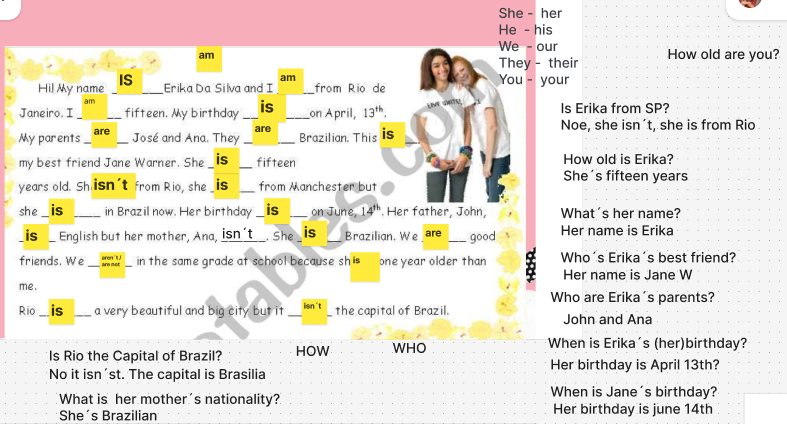
    <h5>[Translations]</h5>
    

        Rain - chover 
        cheers - saúde 
        LOL - risada 
        forget - esquecer 
        fast - rápido 
        know - saber 
        that's it - é isso 
        dinner - jantar
    

    <h5>[Wh - questions]</h5>
    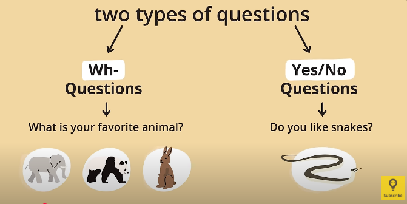
    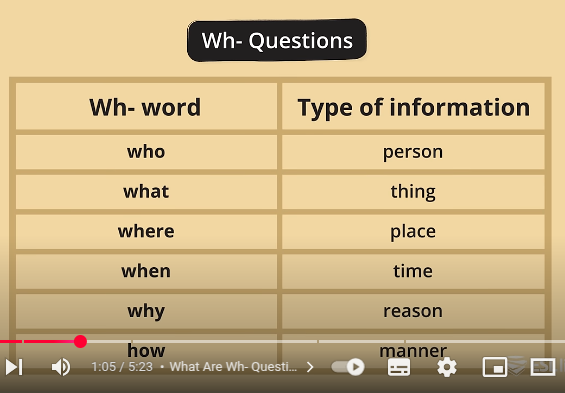
    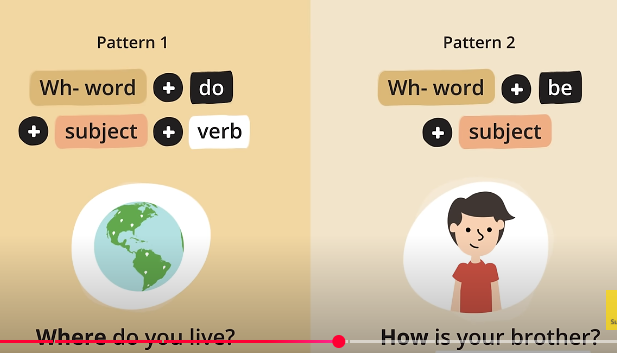
    <h5>[Tuesday's activity]</h5>
    

        (karate-france)(fish and chips-swiss)(the beatles-grece)(flamenco music-chinese)(christian Dior-brtish)(feeat cheese-portuguese)(mercedes-Brazil)(vodka-india)(kung fu-switzerland)  
          
        is the airplane from brazil ? yes, it's brazilian 
        is computer from american ? yes, it's american 
        is the karate from france ? no it isn't. 
        is the vodka from india ? no it isn't , it's from russia
    

    <h5>[Wednesday's activity]</h5>
    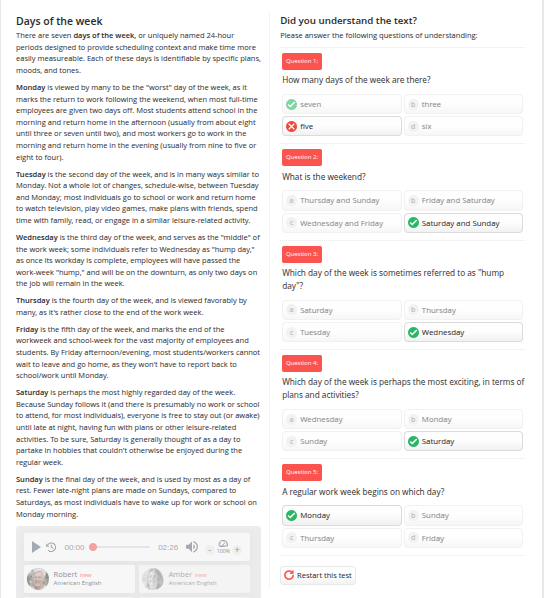

## Class six (didn't have class)- Today is thusday february, 20th, 2025

    <h5>[Didn't have english class]</h5>
    <h5>[Study plan]</h5>
    <table>
        <tr>
            <td>monday</td>
            <td><a href="https://www.youtube.com/watch?v=x_4AjSwTXdc">Wh - questions</a></td>
            <td><i class="fa-solid fa-check" style="color:green;"></i></td>
        </tr>
        <tr>
            <td>tuesday</td>
            <td><a href="https://www.youtube.com/watch?v=VKzaVEG5b9k">Ordinal numbers</a></td>
            <td><i class="fa-solid fa-check" style="color:green;"></i></td>
        </tr>
        <tr>
            <td>wednesday</td>
            <td><a href="https://www.liveworksheets.com/w/en/english-second-language-esl/1003720">Practice the numbers</a></td>
            <td><i class="fa-solid fa-check" style="color:green;"></i></td>
        </tr>
        <tr>
            <td>thursday</td>
            <td>
<strong>didn't have english class</strong>
</td>
            <td><i class="fa-solid fa-check" style="color:green;"></i></td>
        </tr>
        <tr>
            <td>friday</td>
            <td>
Ask more questions about the text in Figma
</td>
            <td><i class="fa-solid fa-x" style="color:red;"></i></td>
        </tr>
        <tr>
            <td>saturday</td>
            <td>
Free: listen a music, watch a movie
</td>
            <td><i class="fa-solid fa-x" style="color:red;"></i></td>
        </tr>
        <tr>
            <td>sunday</td>
            <td>
Free: listen a music, watch a movie
</td>
            <td><i class="fa-solid fa-x" style="color:red;"></i></td>
        </tr>
    </table>
    <h5>[Friday's activity]</h5>
    
 

## Class seven - Today is thursday february, 27th, 2025

    <a href="https://www.youtube.com/watch?v=2PlSlKDx5WQ">Class video</a>
    <h5>[Translations]</h5>
    

        migraine - Enchaqueca  
        headache - Dor de cabeça  
        I have never been to the circus - Nunca fui ao circo
    

    <h5>[Class Activity]</h5>
    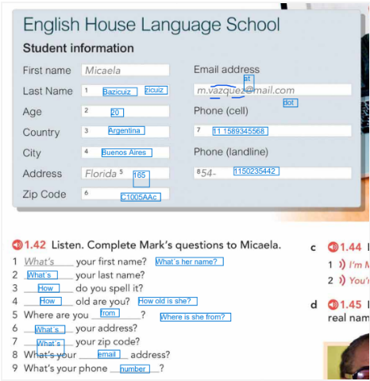
    

        what's her first name ? Her first name is Micaela 
        What's her last name ? Her last name is vazquez 
         
        How do you spell it ? oh, ok! V A Z Q U E Z  
        How old are you ? She is 20 years old  
        How old is she ? She is 20 years old  
         
        Where are you rom ? Argentina, Buenos Aires  
        Where is she froom? Argentina, Buenos Aires  
         
        What's your address ? Florida, 165  
        What's yous zip code ? C 1 000 5886   
        What's your email address ? she phone number is 111589345568
    

    <h5>[Prepositions]</h5>
    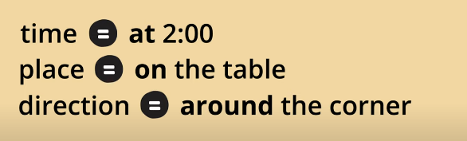
    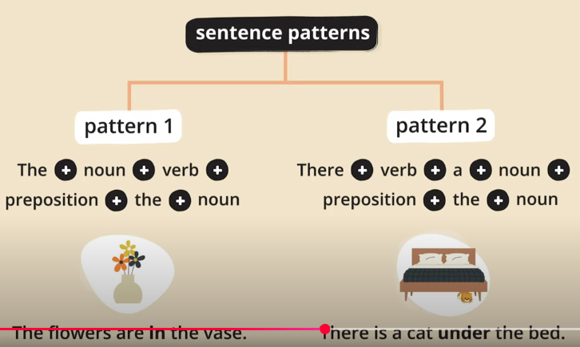
    <h5>[Activities]</h5>
    

        <strong>Review objects</strong>
        <a href="https://www.figma.com/board/cN4HgK5ZYqRAvMwQBmZpiH/Untitled?node-id=0-1&p=f&t=j8tkCHRO5QrlZ7bJ-0">link figma</a>  
        <strong>Write 3 sentences with the objects, describe the objects in your room, living room, kitchen…</strong> 
        There are two tables in my room. 
        There is a computer on the table. 
        There is a trash can nex to the table.  
        <strong>Describe a room in your house explaining where the objects are </strong> 
        Description of my kitchen 
        There is a sofa in front ov the wall 
        There is a refrigerator in front of the sofa 
        There is a stove next to the refrigerator 
        There is a table in front of the stove 
        There is a food on the tables 
        There are two glass on the table  
    

## Class eight - Today is thursday march, 6th, 2025

    <a href="https://www.youtube.com/watch?v=aYYDOVz0HhA">Class video</a>
    <h5>[Content]</h5>
    When is your birthday? 
    march 19th - 19th of march  
    I will be 24 - I'll be 24   
    How was the holiday?  
    I went out to the all you can eat (parmegiana-pizza-barbecue-ice cream) place   
    Things you use everiday ?  
    keyboard, mouse, laptop, cellphone, watch.  
    What objects do you have on the desk ?  
    On my desk i have ... [bottle of water,
    Laptop, mouse, keyboard, cellphone, air frayer, hair's cream, deodorant, electric kettle(chaleira) pencil, medicine(remédio)]  
    What objects do you have in your (purse-bag pack) ? 
    In my bag pack i have ... [laptop,keyboard, mouse, one notebook, laptop's charger and cellphone's charger, two pensil, cards, water bottle]
    <h5>[Objects]</h5>
    a pen(caneta) 
    a wallet(carteira)    
    scissors(tesoura) 
    a piece a paper(folha de papel) 
    a file / a binder (fichairo)  
    a change purse (moedeira) 
    a tissue(lenço umidecido) 
    wardrobe(armario)  
    trash can(lixeira) 
    Chair (cadeira)  
    rug (tapete)
    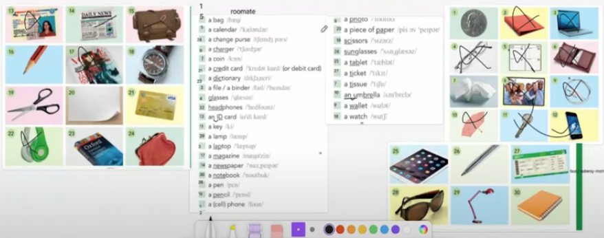
    There is Behaid me a wardrobe.
    <h5>[Translations]</h5>
    Organized - organizado  
    messy - desorganizado  
    eggplant - beringela  
    came - veio  
    come - vem  
    holliday - feriado  
    pool - piscina  
    bar - bar  
    wall - parede   
    shelf - prateleira  
    floor - chão    
    of tem fonética de ov

## Class nine - Today is thursday march, 13rd, 2025

    <a href="https://www.youtube.com/watch?v=4lO_YkoyEC8">Class video</a>
    <h5>[Content]</h5>
    i went to the university park 
    i went out to eat with my girlfriend
    <h5>[Translation]</h5>
    Relativies - parentes 
    parents - pai e mãe 
    uncle - tios 
    How long will you stay in Ceará ? I'll stay two weeks.   
    Where's the object ?  
    There is a notebook on the desk 
    The bag pack is in the front of the wall. 
    the bag pack is above thw shelf. 
    The bed is on the floor. 
    The desk is in front of the wall. 
    The windown is on the wall  
    The chair is in front of the computer  
    Describe the room 
    There is the wall on the floor 
    There are two windowns on the wall 
    There are two windowns between the curtains 
    There is the shelf abode the windowns 
    There are two sofas in front of the shelf 
    There are two  on the shelf 
    There is the lamp on the shelf 
    On the left side of the left sofa there is ebooks pile
    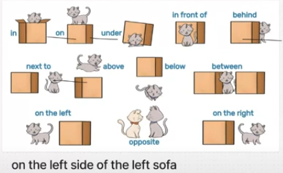

## Class ten - Today is thursday march, 20th, 2025

    <a href="https://www.youtube.com/watch?v=cFCTm_OXw18">Class video</a>
    <h5>[Content]</h5>
    How was your weekend ?  
    i stay home  
    i went to the university  
    Do you play soccer ?  
    Do you drink coffe ?  
    Do you drive a car ?  
    Did you have a dinner ?  
    Yes, i do. OR No, i don't   
    What type of music do you like ?  
    I like funk, sertanejo and trap.  
    (Do) é auxiliar de pergunta pra presente.
    <h5>[Translation]</h5>
    Sock - meia  
    meal - refeição  
    soda - refrigerante  
    ride a bike - bicicleta  

## Class eleven - Today is thursday march, 27th, 2025

    <a href="https://www.youtube.com/watch?v=6avqxWi47lI">Class video</a>
    <h5>[Translation]</h5>
    Company - empresa  
    Travel - viajar  
    siblings - irmãos  
    take care - cuidar  
    <h5>[Content]</h5>
    What was your weekend ? 
    i went to travel i the five stars hotel in the event for company 
    i went the water park   
    (Do) não é usado com verbo to be, precisa de outro verbo  
    What do study at the university ?  
    What's your course at the university ? 
    Where do you live ?  
    Why did you choose your course ? Because, i have mecatronica course  
    What do you do for a living ? I'm for a living developament websites 
    Where do you study ? 
    Do you have siblings ? 
    What's your hobby ?  
    What's favorite color ?  
    Who (will/is going to) order the food ?   
    (at the university) sempre que falar sobre lugar, usar o (at) 
    (in) é mais expecífico pra algo que esta dentro 
    <h5>[Jobs at the United States]</h5>
    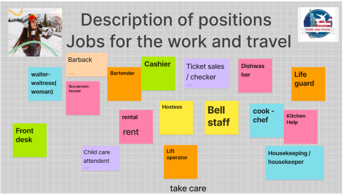
    Dionatan, can you tell me what does a lift do ? 
    Click button, clean the snow and take care the kids at the lift  
    What does a waiter / waitress do ?  
    She/he server peoples 
    He (clean/wipe) tables  
    She takes the order   
    What does a life guard do ?  
    He saves people lives 
    She swims  
    He takes care about people

